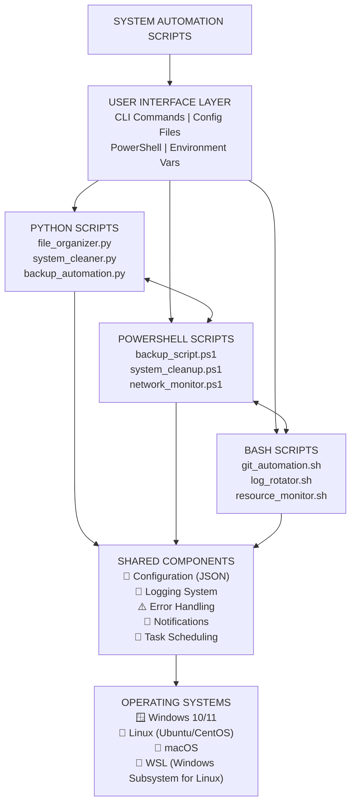

# System Automation Scripts


## 📊 Overview

This toolkit provides ready-to-use automation solutions for everyday system administration tasks. Whether you need to organize your downloads folder, automate backups, or manage git operations, these scripts have you covered. Built with best practices in error handling, logging, and configuration management.

**Why this project?** Automation is a critical skill in modern IT operations. This collection demonstrates:
- ✅ Cross-platform scripting expertise (Windows/Linux/macOS)
- ✅ Real-world automation scenarios
- ✅ Enterprise-grade error handling and logging
- ✅ Configuration-driven design
- ✅ Testable and maintainable code structure

## ✨ Key Features

### 🐍 Python Scripts
| Script | Description |
|--------|-------------|
| **File Organizer** | Automatically sorts files into folders by type, date, or custom rules |
| **Backup Automation** | Incremental backups with compression support |
| **System Cleaner** | Removes temporary files and optimizes disk space |

### ⚡ PowerShell Scripts
| Script | Description |
|--------|-------------|
| **Backup Script** | Creates compressed backups with rotation policy |
| **System Cleanup** | Remove temporary files, clear caches, and free disk space |
| **Network Monitor** | Continuous network connectivity testing with alerts |

### 🔧 Bash Scripts
| Script | Description |
|--------|-------------|
| **Git Automation** | Interactive git operations across repositories |
| **Log Rotator** | Smart log rotation with compression and retention |
| **Resource Monitor** | CPU, memory, and disk usage tracking |

## 🏗️ Architecture



## 🛠️ Technologies Used

| Technology | Purpose |
|------------|---------|
| Python 3.8+ | Core automation logic and cross-platform compatibility |
| PowerShell | Windows-specific automation and system administration |
| Bash | Linux/macOS automation and shell scripting |
| JSON/YAML | Configuration management |
| Schedule | Task scheduling in Python |
| Logging | Centralized logging across all scripts |
| Git | Version control and automation |

## 📁 Project Structure

```text
system-automation-scripts/
│
├── 📁 python/
│   ├── 📄 __init__.py
│   ├── 📄 file_organizer.py        # File organization automation
│   ├── 📄 system_cleaner.py        # Temporary files cleanup
│   ├── 📄 backup_automation.py     # Backup management
│   └── 📄 requirements.txt         # Python dependencies
│
├── 📁 powershell/
│   ├── 📄 backup_script.ps1        # Compressed backups
│   ├── 📄 system_cleanup.ps1       # Windows cleanup
│   ├── 📄 network_monitor.ps1      # Network testing
│   └── 📄 README.md                # PowerShell docs
│
├── 📁 bash/
│   ├── 📄 git_automation.sh        # Git operations
│   ├── 📄 log_rotator.sh           # Log rotation
│   ├── 📄 resource_monitor.sh      # System resources
│   └── 📄 README.md                # Bash docs
│
├── 📁 config/
│   ├── 📄 settings.json            # Global configuration
│   └── 📄 backup_config.json       # Backup settings
│
├── 📁 tests/
│   ├── 📄 test_python.py           # Python unit tests
│   └── 📄 test_powershell.ps1      # PowerShell tests
│
├── 📁 docs/
│   ├── 📁 screenshots/
│   │   ├── 🖼️ screenshot_1_file_organizer.png
│   │   ├── 🖼️ screenshot_2_backup_script.png
│   │   ├── 🖼️ screenshot_3_git_automation.png
│   │   └── 🖼️ screenshot_4_vscode_structure.png
│   └── 📁 examples/                # Usage examples
│
├── 📄 .gitignore                   # Git ignore rules
├── 📄 LICENSE                      # MIT License
├── 📄 setup.ps1                    # Windows setup script
└── 📄 README.md                    # Main documentation
```

## ⚡ Quick Access

```bash
# Python
python python/file_organizer.py --help

# PowerShell
.\powershell\backup_script.ps1 -?

# Bash
chmod +x bash/git_automation.sh && ./bash/git_automation.sh
```

\## 📸 Screenshots


\### File Organizer in Action

!\[File Organizer](docs/screenshots/screenshot\_1\_file\_organizer.png)


\### Backup Script

!\[Backup Script](docs/screenshots/screenshot\_2\_backup\_script.png)


\### Git Automation

!\[Git Automation](docs/screenshots/screenshot\_3\_git\_automation.png)


\### Project Structure

!\[VSCode Structure](docs/screenshots/screenshot\_4\_vscode\_structure.png)


\## 🚀 Getting Started (Windows Instructions)


\### Prerequisites


\- \*\*Python 3.8+\*\* (\[Download](https://www.python.org/downloads/))

\- \*\*Git\*\* (\[Download](https://git-scm.com/download/win))

\- \*\*PowerShell 5.1+\*\* (Built into Windows 10/11)

\- \*\*Git Bash\*\* (\[Included with Git](https://git-scm.com/download/win)) - for bash scripts

\- \*\*VS Code\*\* (recommended) (\[Download](https://code.visualstudio.com/))


\### Installation \& Setup


1\. \*\*Clone the repository\*\*

&#x20;  ```powershell

&#x20;  git clone https://github.com/dianadesiree/system-automation-scripts.git

&#x20;  cd system-automation-scripts


2\. \*\*Clone the repository\*\*

&#x20;  ```powershell

.\\setup.ps1


2\. \*\*Test Python scripts\*\*

&#x20;  ```powershell

cd python

python file\_organizer.py --help


Script Examples

Python File Organizer


\# Organize Downloads folder

python python/file\_organizer.py C:\\Users\\YourName\\Downloads


\# Organize by date within categories

python python/file\_organizer.py C:\\TestFolder --by-date


PowerShell Backup


\# Create compressed backup

.\\powershell\\backup\_script.ps1 -SourcePath "C:\\Important" -DestinationPath "D:\\Backups" -Compress


Bash Git Automation


\# Make script executable

chmod +x bash/git\_automation.sh


\# Run interactive git automation

./bash/git\_automation.sh /path/to/repo


📊 Sample Output

File Organizer Results


📁 Organizing files in: C:\\Users\\Downloads

&#x20; ✅ Moved: image.jpg -> Images/

&#x20; ✅ Moved: doc.pdf -> Documents/

&#x20; ✅ Moved: script.py -> Code/


✅ Organization complete!

&#x20;  Files moved: 15

&#x20;  Categories: 5

&#x20;  Statistics saved to: organization\_stats.json


Backup Script Output


==================================================

&#x20; SYSTEM BACKUP SCRIPT

==================================================

\[2024-01-15 14:30:45] \[INFO] Starting backup process...

\[2024-01-15 14:30:46] \[SUCCESS] Backup created: backup\_20240115\_143045.zip (125.3 MB)

\[2024-01-15 14:30:46] \[INFO] Backup rotation complete. Current backups: 5


🔧 Future Improvements

Add GUI interface for script selection


Implement email notifications for backup status


Create Docker containers for isolated execution


Add scheduling integration (Task Scheduler/Cron)


Develop REST API for remote execution


Add comprehensive test suite


🤝 Contributing

This is a personal learning project, but suggestions are welcome!


Issues: Report bugs or suggest features


Forks: Experiment and create pull requests


Ideas: Share improvements via email


📝 License

This project is licensed under the MIT License - see the LICENSE file for details.


📬 Contact

Diana Araujo


📧 Email: dianadaraujo78@gmail.com


🔗 LinkedIn: linkedin.com/in/dianadaraujo


🌐 Portfolio: dianadesiree3.wixsite.com/my-site


🐙 GitHub: github.com/dianadesiree


Note: These scripts are designed for educational purposes and personal automation. Test in a safe environment before using in production.

