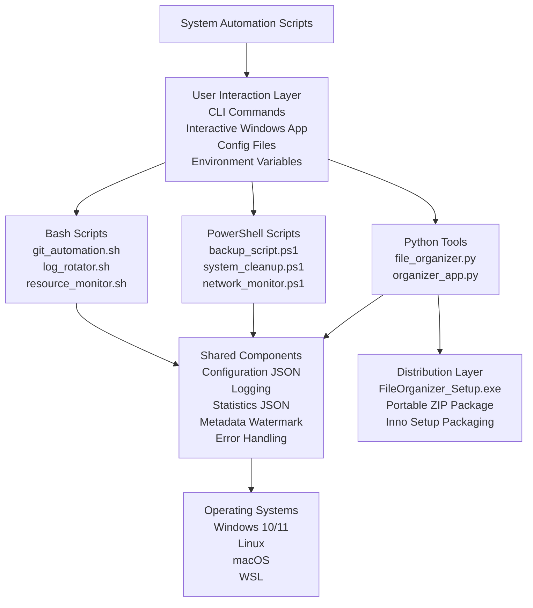

# System Automation Scripts


A cross-platform automation toolkit built with **Python**, **PowerShell**, and **Bash** to automate practical system administration tasks such as file organization, backups, cleanup, log rotation, resource monitoring, and Git workflow support.

This repository now includes a **Windows interactive organizer application**, a **packaged installer**, and a **metadata watermark system** for improved usability, traceability, and professional presentation.

---

## Table of Contents

- [Overview](#overview)
- [What’s New](#whats-new)
- [Why This Project](#why-this-project)
- [Core Features](#core-features)
- [Architecture](#architecture)
- [Technologies Used](#technologies-used)
- [Project Structure](#project-structure)
- [Installation](#installation)
- [Quick Start](#quick-start)
- [Usage Examples](#usage-examples)
- [Screenshots](#screenshots)
- [Roadmap](#roadmap)
- [Contributing](#contributing)
- [License](#license)
- [Contact](#contact)

---

## Overview

**System Automation Scripts** is a practical automation toolkit designed to reduce repetitive manual work across Windows, Linux, macOS, and WSL environments.

It provides scripts and tools for:

- Organizing files automatically by category
- Optionally organizing files by modification date
- Creating and managing compressed backups
- Cleaning temporary and unnecessary files
- Monitoring system and network activity
- Rotating logs and maintaining repositories
- Supporting both technical users and non-technical users through CLI and interactive workflows

The project is structured as a portfolio-ready repository with modular code, reusable scripts, screenshots, documentation, and a packaged Windows installer.

---

## What’s New

The project now includes the following improvements:

- **Interactive Windows organizer application** (`python/organizer_app.py`) that asks the user which folder to organize and whether to organize files by date
- **Installable Windows package** built with **Inno Setup** for easier installation and distribution
- **Watermark metadata system** that creates a `.file_organizer_metadata.txt` file in organized folders to identify the software, author, timestamp, computer, and user
- **Enhanced statistics output** saved in `organization_stats.json` with creator metadata, timestamp, and organization results
- **Improved professional documentation** for portfolio and recruiter review

---

## Why This Project

This project demonstrates:

- Cross-platform scripting across **Windows, Linux, macOS, and WSL**
- Real-world automation use cases for administration and productivity
- A combination of **command-line tools** and a **guided interactive application**
- Better usability through installer-based distribution for Windows users
- Practical software packaging and deployment experience
- Stronger documentation and portfolio presentation for GitHub

---

## Core Features

### Python Tools

| Component | Description |
|-----------|-------------|
| `file_organizer.py` | Command-line file organizer for category-based and date-based organization |
| `organizer_app.py` | Interactive Windows application that prompts for target folder and date-based organization |
| Metadata watermark | Creates `.file_organizer_metadata.txt` in organized folders for traceability |
| `organization_stats.json` | Saves post-run statistics and metadata about the organization process |

### PowerShell Scripts

| Script | Description |
|--------|-------------|
| `backup_script.ps1` | Creates compressed backups with configurable destinations and retention behavior |
| `system_cleanup.ps1` | Cleans temporary files and supports Windows maintenance workflows |
| `network_monitor.ps1` | Monitors connectivity and supports network diagnostics |

### Bash Scripts

| Script | Description |
|--------|-------------|
| `git_automation.sh` | Simplifies repetitive Git operations |
| `log_rotator.sh` | Rotates logs with retention-friendly behavior |
| `resource_monitor.sh` | Tracks system resource usage such as CPU, memory, and disk |

### Distribution and Packaging

| Package | Description |
|---------|-------------|
| `FileOrganizer_Setup.exe` | Windows installer package for easier deployment |
| `FileOrganizer_v1.0.zip` | Portable packaged distribution |
| Inno Setup script | Installer definition for packaging the application |

---

## Architecture



---

## Technologies Used

| Technology | Purpose |
|------------|---------|
| Python 3.8+ | Core automation logic and interactive application support |
| PowerShell 5.1+ | Windows administration and task automation |
| Bash 4.0+ | Linux/macOS shell automation |
| JSON | Statistics and configuration data |
| Inno Setup | Windows installer creation |
| Git | Version control and workflow automation |
| Logging / Metadata Files | Traceability and execution records |

---

## Project Structure

```text
system-automation-scripts/
│
├── python/
│   ├── __init__.py
│   ├── file_organizer.py                 # CLI file organization tool
│   ├── organizer_app.py                  # Interactive Windows organizer app
│   └── requirements.txt                  # Python dependencies
│
├── powershell/
│   ├── backup_script.ps1                 # Compressed backups
│   ├── system_cleanup.ps1                # Windows cleanup tasks
│   ├── network_monitor.ps1               # Network monitoring
│   └── README.md                         # PowerShell documentation
│
├── bash/
│   ├── git_automation.sh                 # Git workflow automation
│   ├── log_rotator.sh                    # Log rotation
│   ├── resource_monitor.sh               # System resource monitoring
│   └── README.md                         # Bash documentation
│
├── config/
│   ├── settings.json                     # Global configuration
│   └── backup_config.json                # Backup-specific settings
│
├── docs/
│   ├── screenshots/
│   │   ├── screenshot_1_file_organizer.png
│   │   ├── screenshot_2_backup_script.png
│   │   ├── screenshot_3_git_automation.png
│   │   ├── screenshot_4_vscode_structure.png
│   │   ├── screenshot_5_organized_folders.png
│   │   ├── screenshot_6_json_stats.png
│   │   ├── screenshot_7_backup_log.png
│   │   ├── screenshot_8_interactive_app_prompt.png
│   │   ├── screenshot_9_interactive_app_summary.png
│   │   ├── screenshot_10_metadata_watermark.png
│   │   └── screenshot_11_windows_installer.png
│   └── examples/
│
├── distribution/
│   └── windows/
│       ├── FileOrganizer_Setup.exe       # Windows installer package
│       └── FileOrganizer_v1.0.zip        # Portable packaged version
│
├── installer/
│   └── installer.iss                     # Inno Setup installer script
│
├── tests/
│   ├── test_python.py                    # Python unit tests
│   └── test_powershell.ps1               # PowerShell tests
│
├── .gitignore                            # Git ignore rules
├── LICENSE                               # License file
├── setup.ps1                             # Windows setup script
└── README.md                             # Main documentation
```

---

## Installation

### Option 1: Run the Python Application

```bash
pip install -r python/requirements.txt
python python/organizer_app.py
```

### Option 2: Use the Windows Installer

For Windows users, the project also includes a packaged installer:

- `distribution/windows/FileOrganizer_Setup.exe`

This installer was created with **Inno Setup** and is intended to make the application easier to install and distribute.

### Option 3: Use the Portable ZIP Package

For a portable version, see:

- `distribution/windows/FileOrganizer_v1.0.zip`

---

## Quick Start

### CLI File Organizer

```bash
python python/file_organizer.py C:\Users\YourName\Downloads
python python/file_organizer.py C:\Users\YourName\Downloads --by-date
```

### Interactive Application

```bash
python python/organizer_app.py
```

The interactive app will:

1. Ask which folder you want to organize
2. Ask whether you want to organize by date
3. Confirm the selected settings
4. Organize the folder contents
5. Save statistics to `organization_stats.json`
6. Create metadata watermark files in destination folders

### PowerShell Backup Script

```powershell
.\powershell\backup_script.ps1 -SourcePath "C:\Important" -DestinationPath "D:\Backups" -Compress
```

### Bash Git Automation

```bash
chmod +x bash/git_automation.sh
./bash/git_automation.sh
```

---

## Usage Examples

### Example: Interactive Windows Organizer

The interactive application is especially useful for users who do not want to type command-line arguments manually.

Typical workflow:

- Launch the organizer app
- Enter a target folder path
- Choose whether to group files by date
- Confirm the action
- Review the summary and generated metadata/statistics files

### Example: Metadata Watermark

After organization, destination folders may include a metadata file named:

```text
.file_organizer_metadata.txt
```

This file can store:

- Software name and version
- Author information
- Website and contact email
- Timestamp of organization
- Computer name and user name
- Copyright notice

### Example: JSON Statistics Output

The organizer also saves an `organization_stats.json` file containing:

- creator metadata
- timestamp
- number of files moved
- categories used
- execution errors, if any

---

## Screenshots

To keep the main README concise, screenshots are linked below instead of embedded.

| Screenshot | Description |
|------------|-------------|
| [File Organizer](docs/screenshots/screenshot_1_file_organizer.png) | Command-line organization workflow |
| [Backup Script](docs/screenshots/screenshot_2_backup_script.png) | PowerShell backup execution |
| [Git Automation](docs/screenshots/screenshot_3_git_automation.png) | Bash Git automation workflow |
| [Project Structure](docs/screenshots/screenshot_4_vscode_structure.png) | Repository layout overview |
| [Organized Folders](docs/screenshots/screenshot_5_organized_folders.png) | Resulting categorized folders after organization |
| [JSON Statistics](docs/screenshots/screenshot_6_json_stats.png) | Saved `organization_stats.json` output |
| [Backup Log](docs/screenshots/screenshot_7_backup_log.png) | Backup log output example |
| [Interactive App Prompt](docs/screenshots/screenshot_8_interactive_app_prompt.png) | Interactive app asking for target folder |
| [Interactive App Summary](docs/screenshots/screenshot_9_interactive_app_summary.png) | Interactive app completion summary |
| [Metadata Watermark](docs/screenshots/screenshot_10_metadata_watermark.png) | Metadata watermark file generated in organized folders |
| [Windows Installer](docs/screenshots/screenshot_11_windows_installer.png) | Installer package visible for Windows distribution |

You can also browse the full screenshot folder here:

- [docs/screenshots](docs/screenshots)

---

## Roadmap

Planned improvements:

- Add drag-and-drop support for the interactive organizer
- Expand notification support for backup and monitoring workflows
- Add CI workflows for automated testing and packaging
- Improve release packaging and GitHub Releases distribution
- Expand test coverage for the interactive application
- Add optional GUI packaging for broader end-user adoption

---

## Contributing

Contributions, suggestions, and improvements are welcome.

1. Fork the repository
2. Create a feature branch
3. Commit your changes
4. Push your branch
5. Open a pull request

For major changes, consider opening an issue first to discuss the proposal.

---

## License

This repository includes a custom license file in `LICENSE`.

> Important: if you intend to keep commercial-use restrictions or additional author-control restrictions, do not label the project as standard MIT in the README or badge. Standard MIT does not include those extra restrictions.

Update this section so that the license badge and the actual license text match.

---

## Contact

**Diana Araujo**

- Email: `dianadaraujo78@gmail.com`
- GitHub: `https://github.com/dianadesiree`
- LinkedIn: `https://linkedin.com/in/your-profile`
- Portfolio: `https://your-portfolio-link.com`

> Replace the placeholder LinkedIn and portfolio links before publishing.

---

## Notes

- This project combines automation scripting, packaging, installer creation, and documentation into a portfolio-ready repository.
- For the most professional presentation, consider keeping packaged binaries inside `distribution/windows/` instead of the repository root.
- For distribution to end users, GitHub Releases is a better long-term home for `.exe` installers than the main source tree.
