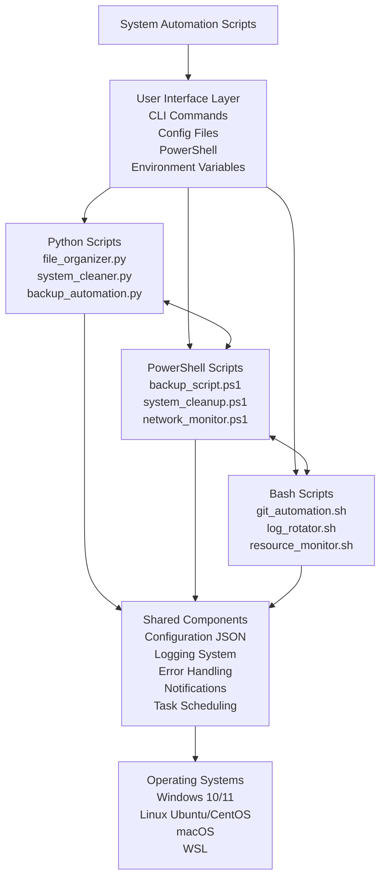
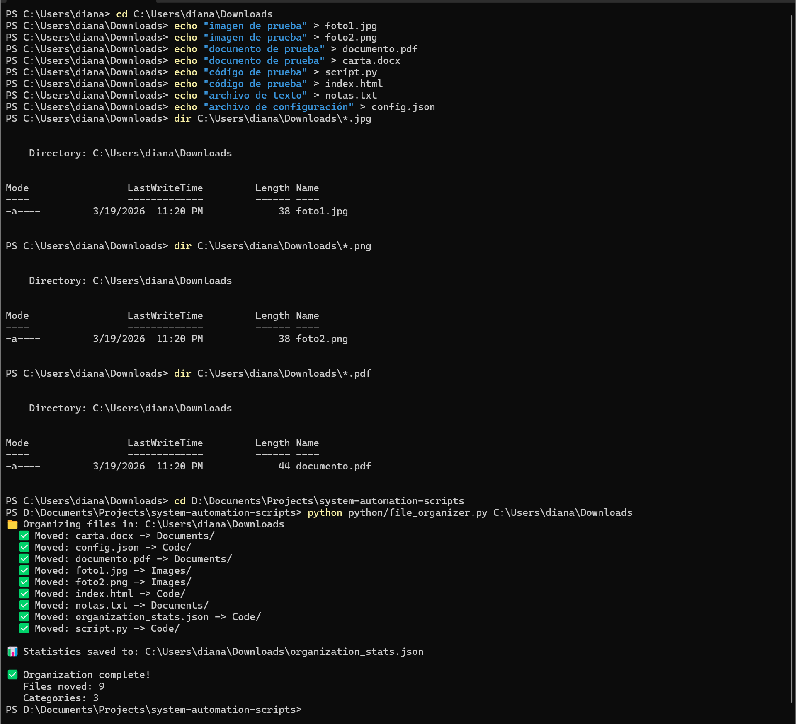
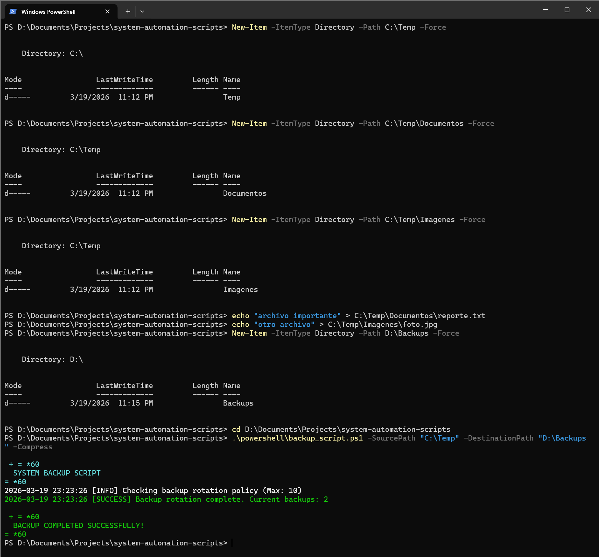
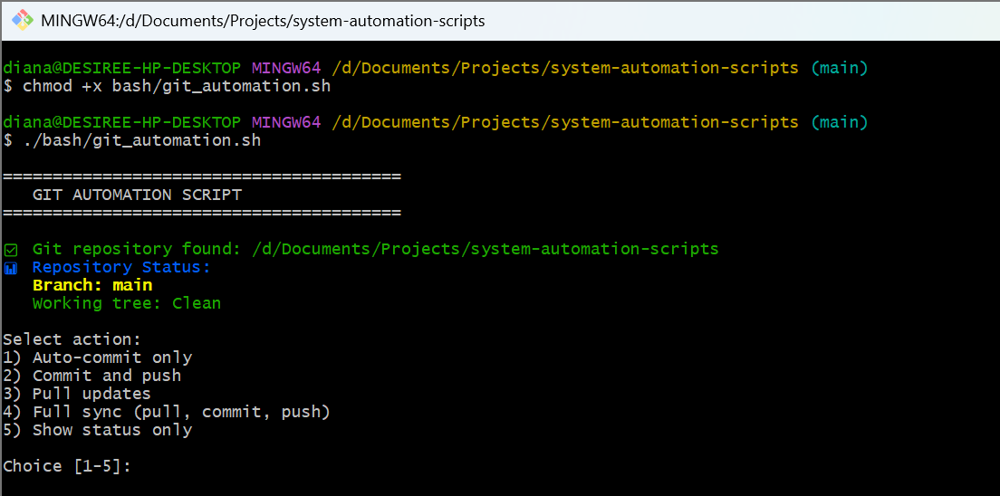
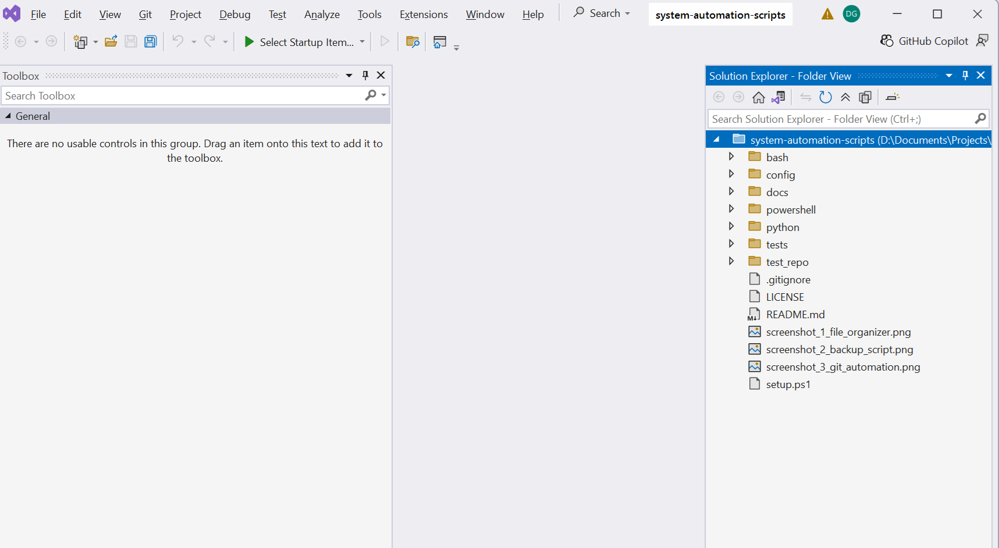

# System Automation Scripts


A cross-platform automation toolkit that combines **Python**, **PowerShell**, and **Bash** scripts for common system administration tasks such as file organization, backups, cleanup, log rotation, resource monitoring, and Git workflow automation.

---

## Table of Contents

- [Overview](#overview)
- [Why This Project](#why-this-project)
- [Core Features](#core-features)
- [Architecture](#architecture)
- [Technologies Used](#technologies-used)
- [Project Structure](#project-structure)
- [Quick Start](#quick-start)
- [Usage Examples](#usage-examples)
- [Screenshots](#screenshots)
- [Roadmap](#roadmap)
- [Contributing](#contributing)
- [License](#license)
- [Contact](#contact)

---

## Overview

**System Automation Scripts** is a practical toolkit designed to simplify repetitive IT and system maintenance tasks.

It provides ready-to-use scripts for:

- Organizing files automatically
- Creating and managing backups
- Cleaning temporary or unnecessary files
- Rotating and managing logs
- Monitoring system resources
- Automating Git-related tasks

The repository is structured to be clear, modular, and easy to extend.

---

## Why This Project

This project demonstrates:

- Cross-platform scripting across **Windows, Linux, macOS, and WSL**
- Real-world automation use cases for administration and productivity
- Reusable script design with shared configuration support
- Cleaner organization for maintainability and scalability
- A portfolio-ready repository structure for GitHub

---

## Core Features

### Python Scripts

| Script | Description |
|--------|-------------|
| `file_organizer.py` | Automatically organizes files by type, date, or custom rules |
| `system_cleaner.py` | Removes temporary files and helps recover disk space |
| `backup_automation.py` | Handles backup workflows with configurable behavior |

### PowerShell Scripts

| Script | Description |
|--------|-------------|
| `backup_script.ps1` | Creates compressed backups with configurable destinations |
| `system_cleanup.ps1` | Cleans temporary files and improves Windows maintenance workflows |
| `network_monitor.ps1` | Monitors connectivity and supports basic network diagnostics |

### Bash Scripts

| Script | Description |
|--------|-------------|
| `git_automation.sh` | Simplifies repetitive Git operations |
| `log_rotator.sh` | Rotates logs with retention-friendly behavior |
| `resource_monitor.sh` | Tracks system resource usage such as CPU, memory, and disk |

---

## Architecture



---

## Technologies Used

| Technology | Purpose |
|------------|---------|
| Python 3.8+ | Core automation logic and cross-platform scripting |
| PowerShell 5.1+ | Windows administration and task automation |
| Bash 4.0+ | Linux/macOS shell automation |
| JSON / YAML | Centralized configuration management |
| Logging | Consistent output and traceability across scripts |
| Schedule / Task Scheduler / Cron | Task scheduling support |
| Git | Version control and workflow automation |

---

## Project Structure

```text
system-automation-scripts/
│
├── python/
│   ├── __init__.py
│   ├── file_organizer.py          # File organization automation
│   ├── system_cleaner.py          # Temporary files cleanup
│   ├── backup_automation.py       # Backup management
│   └── requirements.txt           # Python dependencies
│
├── powershell/
│   ├── backup_script.ps1          # Compressed backups
│   ├── system_cleanup.ps1         # Windows cleanup tasks
│   ├── network_monitor.ps1        # Network monitoring
│   └── README.md                  # PowerShell-specific documentation
│
├── bash/
│   ├── git_automation.sh          # Git workflow automation
│   ├── log_rotator.sh             # Log rotation
│   ├── resource_monitor.sh        # System resource monitoring
│   └── README.md                  # Bash-specific documentation
│
├── config/
│   ├── settings.json              # Global configuration
│   └── backup_config.json         # Backup-specific settings
│
├── tests/
│   ├── test_python.py             # Python unit tests
│   └── test_powershell.ps1        # PowerShell tests
│
├── docs/
│   ├── screenshots/
│   │   ├── screenshot_1_file_organizer.png
│   │   ├── screenshot_2_backup_script.png
│   │   ├── screenshot_3_git_automation.png
│   │   └── screenshot_4_vscode_structure.png
│   └── examples/                  # Usage examples
│
├── .gitignore                     # Git ignore rules
├── LICENSE                        # MIT License
├── setup.ps1                      # Windows setup script
└── README.md                      # Main documentation
```

---

## Quick Start

### Prerequisites

Install the tools that apply to your environment:

- **Python 3.8+**
- **Git**
- **PowerShell 5.1+** (Windows)
- **Bash** (Linux, macOS, or WSL)

### Clone the Repository

```bash
git clone https://github.com/YOUR_USERNAME/system-automation-scripts.git
cd system-automation-scripts
```

### Python Setup

```bash
pip install -r python/requirements.txt
python python/file_organizer.py --help
```

### PowerShell Setup

```powershell
.\powershell\backup_script.ps1 -?
```

### Bash Setup

```bash
chmod +x bash/git_automation.sh
./bash/git_automation.sh
```

---

## Usage Examples

### File Organizer

Organize a downloads folder:

```bash
python python/file_organizer.py C:\Users\YourName\Downloads
```

Organize files by date:

```bash
python python/file_organizer.py C:\TestFolder --by-date
```

### Backup Script

Create a compressed backup with PowerShell:

```powershell
.\powershell\backup_script.ps1 -SourcePath "C:\Important" -DestinationPath "D:\Backups" -Compress
```

### Git Automation

Run the Bash Git automation script:

```bash
chmod +x bash/git_automation.sh
./bash/git_automation.sh /path/to/repo
```

### Quick Access Commands

```text
Python:
python python/file_organizer.py --help

PowerShell:
.\powershell\backup_script.ps1 -?

Bash:
chmod +x bash/git_automation.sh && ./bash/git_automation.sh
```

---

## Screenshots

### File Organizer



### Backup Script



### Git Automation



### Project Structure



---

## Roadmap

Planned improvements:

- Add a simple menu-based interface for script selection
- Expand notification support for backup and monitoring workflows
- Add Docker support for isolated execution
- Improve scheduling integrations with Task Scheduler and Cron
- Expand automated testing coverage
- Add CI support with GitHub Actions

---

## Contributing

Contributions, suggestions, and improvements are welcome.

1. Fork the repository
2. Create a feature branch
3. Commit your changes
4. Push your branch
5. Open a pull request

For major changes, consider opening an issue first to discuss the proposal.

---

## License

This project is licensed under the **MIT License**.
See the [LICENSE](LICENSE) file for details.

---

## Contact

**Diana Araujo**

- Email: `your-email@example.com`
- LinkedIn: `https://linkedin.com/in/your-profile`
- GitHub: `https://github.com/your-username`
- Portfolio: `https://your-portfolio-link.com`

> Replace the placeholder links above with your real contact information before publishing.

---

## Notes

- This repository is ideal as a **portfolio project**, **learning project**, or **starter automation toolkit**.
- Keep screenshots optimized and scripts documented for the best GitHub presentation.
- If Mermaid does not render in a local Markdown viewer, GitHub web view should still display it correctly.
