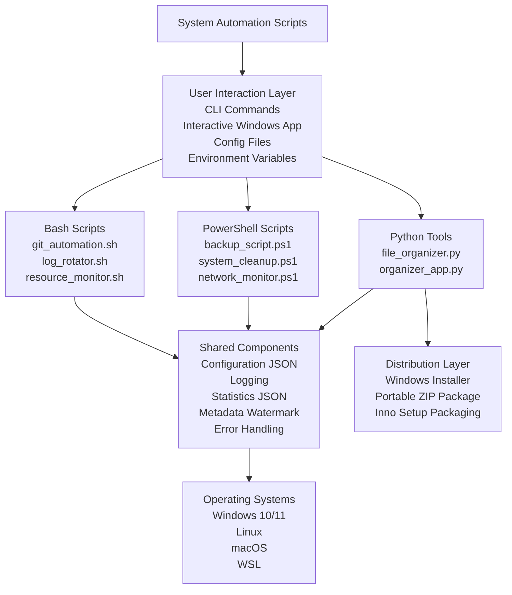

# System Automation Scripts


A cross-platform automation toolkit built with **Python**, **PowerShell**, and **Bash** to automate practical system administration tasks such as file organization, backups, cleanup, log rotation, resource monitoring, and Git workflow support.

This repository also includes a **Windows interactive organizer application**, a **packaged installer**, a **portable distribution**, and a **metadata watermark system** for improved usability, traceability, and professional presentation.

---

## Table of Contents

- [Overview](#overview)
- [Highlights](#highlights)
- [Core Features](#core-features)
- [Architecture](#architecture)
- [Technologies Used](#technologies-used)
- [Project Structure](#project-structure)
- [Installation](#installation)
- [Quick Start](#quick-start)
- [Usage Examples](#usage-examples)
- [Screenshots](#screenshots)
- [Roadmap](#roadmap)
- [Contributing](#contributing)
- [License](#license)
- [Contact](#contact)

---

## Overview

**System Automation Scripts** is a portfolio-ready automation project designed to reduce repetitive manual work across **Windows, Linux, macOS, and WSL** environments.

It includes tools for:

- Organizing files automatically by category
- Optionally organizing files by modification date
- Creating and managing compressed backups
- Cleaning temporary and unnecessary files
- Monitoring system and network activity
- Rotating logs and supporting Git workflows
- Providing both **command-line** and **interactive Windows** workflows

The project is structured to demonstrate practical scripting, packaging, installer creation, documentation, and end-user usability.

---

## Highlights

This version includes several improvements that make the project stronger for portfolio and recruiter review:

- **Interactive Windows organizer application** for users who prefer guided prompts over manual CLI arguments
- **Optional date-based organization** during file sorting
- **Metadata watermark files** generated inside organized folders for traceability
- **Enhanced JSON statistics output** with creator metadata and execution results
- **Windows installer package** built with **Inno Setup**
- **Portable ZIP distribution** for easier testing and sharing
- **Professional documentation and screenshot-based proof of functionality**

---

## Core Features

### Python Tools

| Component | Description |
|-----------|-------------|
| `file_organizer.py` | Command-line file organizer for category-based and optional date-based organization |
| `organizer_app.py` | Interactive Windows organizer application that prompts for a folder path and organization preferences |
| Metadata watermark | Creates `.file_organizer_metadata.txt` in organized folders for traceability |
| `organization_stats.json` | Saves execution statistics and metadata after each organization run |

### PowerShell Scripts

| Script | Description |
|--------|-------------|
| `backup_script.ps1` | Creates compressed backups with configurable source, destination, and retention support |
| `system_cleanup.ps1` | Cleans temporary files and supports Windows maintenance workflows |
| `network_monitor.ps1` | Monitors connectivity and supports basic network diagnostics |

### Bash Scripts

| Script | Description |
|--------|-------------|
| `git_automation.sh` | Simplifies repetitive Git operations |
| `log_rotator.sh` | Rotates logs with retention-friendly behavior |
| `resource_monitor.sh` | Tracks CPU, memory, and disk usage |

### Packaging and Distribution

| Package | Description |
|---------|-------------|
| `FileOrganizer_Setup.exe` | Windows installer package for easier deployment |
| `FileOrganizer_v1.0.zip` | Portable packaged version |
| `installer.iss` | Inno Setup script used to build the installer |

---

## Architecture



---

## Technologies Used

| Technology | Purpose |
|------------|---------|
| Python 3.8+ | Core automation logic and interactive application support |
| PowerShell 5.1+ | Windows administration and maintenance automation |
| Bash 4.0+ | Linux/macOS shell automation |
| JSON | Configuration, statistics, and metadata storage |
| Inno Setup | Windows installer creation |
| Git | Version control and workflow automation |
| Logging / Metadata Files | Traceability and execution records |

---

## Project Structure

```text
system-automation-scripts/
│
├── python/
│   ├── file_organizer.py                 # CLI file organization tool
│   ├── organizer_app.py                  # Interactive Windows organizer app
│   └── requirements.txt                  # Python dependencies
│
├── powershell/
│   ├── backup_script.ps1                 # Compressed backups
│   ├── system_cleanup.ps1                # Windows cleanup tasks
│   ├── network_monitor.ps1               # Network monitoring
│   └── README.md                         # PowerShell documentation
│
├── bash/
│   ├── git_automation.sh                 # Git workflow automation
│   ├── log_rotator.sh                    # Log rotation
│   ├── resource_monitor.sh               # System resource monitoring
│   └── README.md                         # Bash documentation
│
├── config/
│   ├── settings.json                     # Global configuration
│   └── backup_config.json                # Backup-specific settings
│
├── docs/
│   ├── screenshots/
│   │   ├── screenshot_1_file_organizer.png
│   │   ├── screenshot_2_backup_script.png
│   │   ├── screenshot_3_git_automation.png
│   │   ├── screenshot_4_vscode_structure.png
│   │   ├── screenshot_5_organized_folders.png
│   │   ├── screenshot_6_json_stats.png
│   │   ├── screenshot_7_backup_log.png
│   │   ├── screenshot_8_interactive_app_prompt.png
│   │   ├── screenshot_9_interactive_app_summary.png
│   │   ├── screenshot_10_metadata_watermark.png
│   │   └── screenshot_11_windows_installer.png
│   └── examples/
│
├── distribution/
│   └── windows/
│       ├── FileOrganizer_Setup.exe       # Windows installer package
│       └── FileOrganizer_v1.0.zip        # Portable packaged version
│
├── installer/
│   └── installer.iss                     # Inno Setup installer script
│
├── tests/
│   ├── test_python.py                    # Python unit tests
│   └── test_powershell.ps1               # PowerShell tests
│
├── .gitignore                            # Git ignore rules
├── LICENSE                               # Custom license
├── setup.ps1                             # Windows setup script
└── README.md                             # Main documentation
```

---

## Installation

### Option 1: Run the Python Application

```bash
pip install -r python/requirements.txt
python python/organizer_app.py
```

### Option 2: Use the Windows Installer

For Windows users, the project includes a packaged installer:

- `distribution/windows/FileOrganizer_Setup.exe`

This installer was created with **Inno Setup** to simplify installation and distribution.

### Option 3: Use the Portable ZIP Package

For a portable version, use:

- `distribution/windows/FileOrganizer_v1.0.zip`

---

## Quick Start

### CLI File Organizer

```bash
python python/file_organizer.py C:\Users\YourName\Downloads
python python/file_organizer.py C:\Users\YourName\Downloads --by-date
```

### Interactive Organizer App

```bash
python python/organizer_app.py
```

The interactive app will:

1. Ask which folder you want to organize
2. Ask whether you want to organize files by date
3. Confirm the selected settings
4. Organize the folder contents
5. Save statistics to `organization_stats.json`
6. Create metadata watermark files in destination folders

### PowerShell Backup Script

```powershell
.\powershell\backup_script.ps1 -SourcePath "C:\Important" -DestinationPath "D:\Backups" -Compress
```

### Bash Git Automation

```bash
chmod +x bash/git_automation.sh
./bash/git_automation.sh
```

---

## Usage Examples

### Interactive Organizer Workflow

The interactive application is useful for users who do not want to type command-line arguments manually.

Typical workflow:

- Launch the organizer app
- Enter a target folder path
- Choose whether to group files by date
- Confirm the action
- Review the summary
- Inspect generated metadata and JSON statistics files

### Metadata Watermark Example

After organization, destination folders may include a metadata file named:

```text
.file_organizer_metadata.txt
```

This file may contain:

- software name and version
- author information
- website and contact email
- timestamp of organization
- computer name and user name
- copyright notice

### JSON Statistics Example

The organizer also saves an `organization_stats.json` file containing:

- creator metadata
- timestamp
- number of files moved
- categories used
- execution errors, if any

---

## Screenshots

To keep the main README concise, screenshots are linked below instead of embedded.

| Screenshot | Description |
|------------|-------------|
| [File Organizer](docs/screenshots/screenshot_1_file_organizer.png) | Command-line organization workflow |
| [Backup Script](docs/screenshots/screenshot_2_backup_script.png) | PowerShell backup execution |
| [Git Automation](docs/screenshots/screenshot_3_git_automation.png) | Bash Git automation workflow |
| [Project Structure](docs/screenshots/screenshot_4_vscode_structure.png) | Repository layout overview |
| [Organized Folders](docs/screenshots/screenshot_5_organized_folders.png) | Categorized folder results after organization |
| [JSON Statistics](docs/screenshots/screenshot_6_json_stats.png) | Saved `organization_stats.json` output |
| [Backup Log](docs/screenshots/screenshot_7_backup_log.png) | Backup log output example |
| [Interactive App Prompt](docs/screenshots/screenshot_8_interactive_app_prompt.png) | Interactive app asking for the target folder |
| [Interactive App Summary](docs/screenshots/screenshot_9_interactive_app_summary.png) | Interactive app completion summary |
| [Metadata Watermark](docs/screenshots/screenshot_10_metadata_watermark.png) | Metadata watermark file generated in organized folders |
| [Windows Installer](docs/screenshots/screenshot_11_windows_installer.png) | Windows installer package for distribution |

You can also browse the full screenshot folder here:

- [docs/screenshots](docs/screenshots)

---

## Roadmap

Planned improvements:

- Add drag-and-drop support for the interactive organizer
- Expand notification support for backup and monitoring workflows
- Add CI workflows for automated testing and packaging
- Improve release packaging through GitHub Releases
- Expand test coverage for the interactive application
- Explore an optional GUI version for broader end-user adoption

---

## Contributing

Contributions, suggestions, and improvements are welcome.

1. Fork the repository
2. Create a feature branch
3. Commit your changes
4. Push your branch
5. Open a pull request

For major changes, consider opening an issue first to discuss the proposal.

---

## License

This project uses the custom license included in the `LICENSE` file.

Please review the license terms before redistribution, modification, or commercial use.

---

## Contact

**Diana Araujo**

- Email: `dianadaraujo78@gmail.com`
- GitHub: `https://github.com/dianadesiree`

---

## Notes

- This project combines automation scripting, packaging, installer creation, and documentation in a portfolio-ready repository.
- Keeping packaged binaries inside `distribution/windows/` helps maintain a cleaner source tree.
- For long-term end-user distribution, **GitHub Releases** is usually a better location for `.exe` installers than the main source tree.
